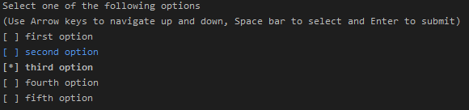

# C# Console Application Checkboxes


### To use in own System
1. Possibility
    * Copy Checkbox.cs class to the same directory like _Program.cs_ is in (\<Project directory\>/\<Project name\>/Checkbox.cs)
    * Goto your \<Project name\>.csproj
    * Search for _Compile_ and add in scope of this \<ItemGroup\> another tag like the others: ``<Compile Include="Checkbox.cs" />``

2. Possibility
    * Add a file called _Checkbox.cs_ using your IDE
    * Copy paste the Code from [Checkbox/Checkbox.cs](Checkbox/Checkbox.cs)

### Usage:
###### Code examples in [Checkbox/Program.cs](Checkbox/Program.cs)

```c#
// First create a Checkbox object

// First parameter is the headline shown above the select boxes
string checkboxHeadline = "Select one of the following options";
// Standarts are no multiple selection and selection is required
// As select option you either can give an array as parameter
string[] opts = {"1. option", "2. option", "3. option" /* ... */};
Checkbox c1 = new Checkbox(checkboxHeadline, opts);
// Or directly as function parameter
Checkbox c2 = new Checkbox(checkboxHeadline, /* options: */ "1. option", "2. option", "3. option" /* ... */);

// If you want to disable requirement of the checkboxes to be checked
Checkbox c3 = new Checkbox(checkboxHeadline, /* multi-mode: */ false, /* required: */ false, opts);


// After creating the Checkbox object
// Call the Select method which returns the selected indices and option strings
var res1 = c1.Select();
```

#### Example display would be something like this


#### Example output would be something like this
###### if using the method like in [Checkbox/Program.cs](Checkbox/Program.cs)

The integer refers to the index of the option
The string refers to the text of the option
```
2
third option
```

If multiple options are selected all indices and texts will be outputted
